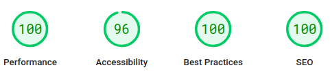

# Myeeko

### To Do List
- [x] readme.md
- [x] index.html
- [x] head tags
- [x] favicon.ico
- [x] optimise css
- [x] robots.txt
- [x] sitemap.xml
- [ ] accessibility

### About Myeeko :tada:
Welcome to my GitHub profile!

This is where I share my coding adventures and projects. You'll find a mix of personal projects and collaborations. I update this when i feel inspired so regular updates are a bit of a hit and miss. 

I'm particularly interested in:
* HMTL
* CSS
* Javascript
* Python
* json

You'll see examples of that in several of my repositories. The projects here are a mix of polished finished products and works in progress, both being valuable parts of my learning journey. :sparkles:

Kind Regards,

Myeeko

---
#### Disclaimer
While I’ve done my best to make this as helpful and reliable as possible, please remember that you’re using this at your own risk. I can’t guarantee everything will work perfectly, and I’m not responsible for any hiccups or issues that may arise along the way. I hope it helps, but always double-check and proceed with care. :star2:
